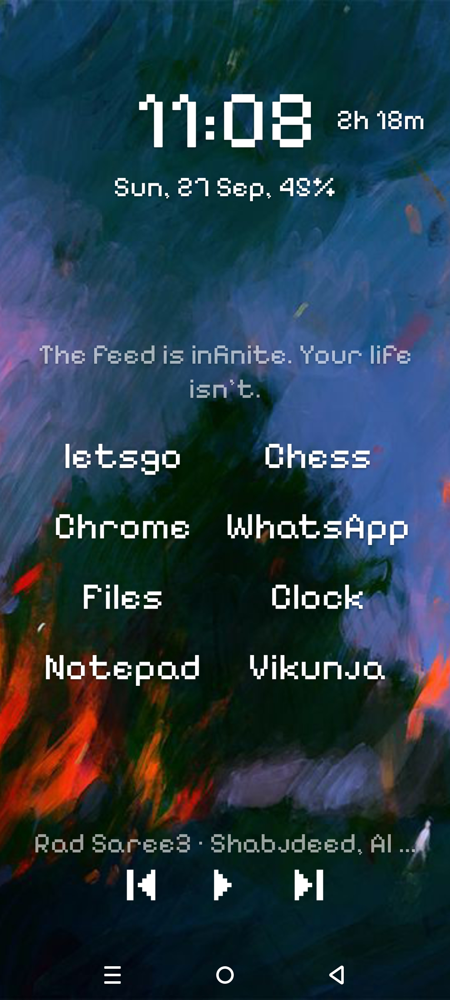
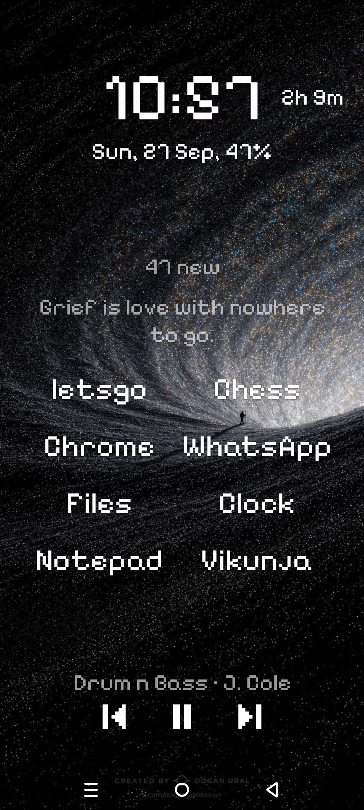
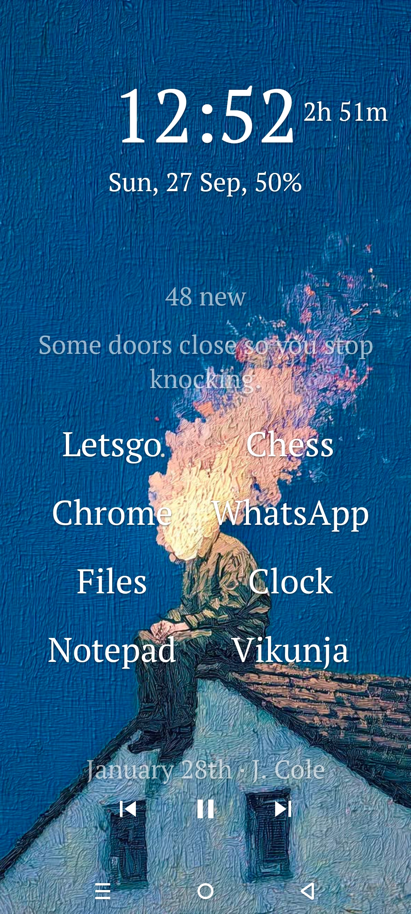

# Husk

A minimal, pixelated Android launcher. Text instead of icons, a pixel typeface that also covers
Arabic, and enough of a phone (dialer, media, notifications) that you rarely leave the home screen.






Husk is a fork of [Olauncher](https://github.com/tanujnotes/Olauncher). It is a personal project
built for my own phone first. It is published because it works well enough for me to use every day,
not because it is a finished product. Read the [State](#state) section before you install it.

## Features

Everything listed here works on my device (Android 15). Anything that does not work is in
[State](#state), not hidden here.

1. **Home screen.** Up to 8 apps in a two-column grid, with an optional clock, date and screen
   time line. Long press anywhere to open settings.
2. **App drawer.** Swipe up, then type to filter. Recently launched apps sit on top. Auto-launch
   fires when exactly one app matches, so most launches are two or three keystrokes.
3. **Dialer.** Swipe down for a searchable contact list with recent calls. Search by name or by
   number, tap once to call, long press for WhatsApp.
4. **Media controls.** Previous / play / next on the home screen. It drives VLC by preference and
   falls back to any player that exposes a `MediaBrowserService`, which is how it stays a few lines
   instead of a per-app integration.
5. **Notifications.** A single line on the home screen shows the newest notification. Tap it to
   open and dismiss in one move, or open the full panel for the list with swipe-to-dismiss.
6. **Per-app internet blocking.** Pick apps in settings, and they lose network access. This runs a
   local `VpnService` that drops their traffic, so it needs no root, and no traffic leaves your
   device through anyone's server. See [Privacy](PRIVACY.md).
7. **Quotes.** One short line on the home screen, sometimes gentle, sometimes harsh. A new one
   each time you unlock or come back home, tap it for another. Bundled in the app, no network.
8. **Backgrounds.** Device wallpaper, a solid colour, a gradient, or your own image.
9. **Voice recorder.** Both volume keys at once, or a quick settings tile, starts recording from
   the lock screen, from inside any app, with the screen off. Recordings stay in Husk's private
   storage: no gallery entry, no other app can read them, and they do not leave the device for any
   reason. Off by default. Android shows an ongoing notification and the green microphone dot for
   as long as it runs, and neither can be hidden, so this records openly.
10. **Arabic.** Full Arabic support in a matching pixel typeface. This is the reason the fork exists.
   Every other minimal launcher I tried falls back to a system face the moment you write Arabic,
   which breaks the whole look.

## State

This is a work in progress and I would rather tell you where the edges are than have you find them.

1. **The launcher icon is a placeholder.** A pixel H on the dark background, drawn on the same
   10dp grid as the typeface. It is honest and it is mine, but it is the work of a developer and
   not a designer, and it will be replaced.
2. **Translations are inherited and stale.** 20 languages came from Olauncher's contributors and
   still cover the inherited UI, but every string Husk added (dialer, blocking, notifications,
   quotes) exists only in English. Only English and Arabic are maintained.
4. **Test coverage is thin.** Unit tests cover dialer search matching, recording names and quote
   rotation. Everything else is verified by using the launcher daily, which catches what I do and nothing else.
5. **Internet blocking holds one VPN slot.** Android allows exactly one active VPN, so Husk's
   blocker and a real VPN cannot run at the same time. If you need a VPN, you cannot use this
   feature. This is a platform limit, not a bug I can fix.
6. **The recorder cannot be silent, and should not be.** Android only grants the microphone in the
   background to a foreground service, and a foreground service must post a notification. On top of
   that the system shows a green microphone dot. Husk does not try to work around either. Recording
   people who have not been told is illegal in many places; check your own law before you rely on
   this.
7. **The volume chord depends on the accessibility service.** Without it only the quick settings
   tile works. The chord never swallows a volume key, so the volume dialog still appears when it
   fires, and you will have stepped the volume once.
8. **Tested on one phone.** Android 15, one device, one ROM. `minSdk` is 24 and it should work
   further back, but "should" is doing real work in that sentence.

Note: Husk is not on the Play Store and I have no plans to put it there. The `VpnService`,
notification listener and usage-stats permissions each invite a policy review, and three reviews
for a launcher I wrote for myself is a bad trade.

## Install

Grab the APK from [Releases](https://github.com/munjed-ab/husk/releases), or build it yourself:

```
./gradlew assembleDebug          # debug build, no signing needed
./gradlew assembleRelease        # release build, needs keystore.properties, see below
```

To produce a signed release build, create `keystore.properties` in the repo root. It is
gitignored, so your key never enters the repository:

```properties
storeFile=/absolute/path/to/husk.jks
storePassword=...
keyAlias=husk
keyPassword=...
```

Generate the key once with:

```
keytool -genkeypair -v -keystore husk.jks -keyalg RSA -keysize 4096 -validity 10000 -alias husk
```

Without `keystore.properties` the release build still runs, it just comes out unsigned.

## Permissions

Each permission exists for exactly one feature, and the feature dies without it.

| Permission | Used by |
|---|---|
| `READ_CONTACTS`, `CALL_PHONE`, `READ_CALL_LOG` | Dialer |
| `PACKAGE_USAGE_STATS` | Screen time line, recent apps ordering |
| `BIND_NOTIFICATION_LISTENER_SERVICE` | Notification line and panel |
| `BIND_VPN_SERVICE`, `FOREGROUND_SERVICE` | Per-app internet blocking |
| `QUERY_ALL_PACKAGES` | Listing apps in the drawer, which is what a launcher is |
| `INTERNET` | The local VPN's loopback |
| `SET_WALLPAPER` | Solid colour and gradient backgrounds |
| Accessibility service | Double tap to lock, optional and off by default |

## FAQ

### Double tap to lock does nothing

The accessibility service is off by default. Turn on Husk's accessibility service in your device
settings, under Installed apps or Downloaded apps depending on the ROM. It is used for the lock
gesture and nothing else.

If it is already on and the gesture still does nothing, some manufacturers (Xiaomi, Oppo, Vivo)
kill accessibility services in the background to save battery. Whitelist Husk in your battery
settings.

### Gestures do not work on my device

Some ROMs do not hand navigation gestures to a downloaded launcher. Only a manufacturer update
fixes that, there is nothing Husk can do from inside the app.

### Where are my hidden apps

Long press an app in the drawer to hide it. To see hidden apps again, open settings and tap
"Husk" at the top.

## Privacy

Husk collects nothing, sends no analytics, and has no crash reporter. One feature touches the
network and it is optional. The details are in [PRIVACY.md](PRIVACY.md).

## Differences from upstream

For anyone comparing against Olauncher:

1. Added: dialer, media controls, notification line and panel, per-app internet blocking, home
   quotes, voice recorder, two-column home grid, background options, Arabic pixel typography.
2. Removed: daily wallpaper rotation. It fetched an index from the upstream author's personal
   GitHub gist, which is a third-party service this fork does not control and cannot keep alive.
3. Removed: the Play Store rating prompt and the settings footer advertising another app.
4. Renamed: package `app.olauncher` to `com.munjed.husk`.

## Credits

Husk is a fork of [Olauncher](https://github.com/tanujnotes/Olauncher) by tanujnotes. The
minimal launcher core, the app drawer, the gesture handling and 20 translations are his work.

Fonts: [Pixelify Sans](https://github.com/eifetx/Pixelify-Sans), [Handjet](https://github.com/rosettatype/Handjet),
[Poppins](https://github.com/itfoundry/Poppins), [Tajawal](https://github.com/boutrosfonts/Tajawal),
[PT Serif](https://company.paratype.com/pt-serif), [Scheherazade New](https://github.com/silnrsi/font-scheherazade),
[Patrick Hand](https://github.com/pwagesr/patrickhand) and [Katibeh](https://github.com/khaledhosny/katibeh-font), all
under the SIL Open Font License. Licence texts are in [licenses/](licenses/).

## Licence

GPL-3.0, inherited from Olauncher. See [LICENSE](LICENSE).

[github.com/munjed-ab](https://github.com/munjed-ab)
